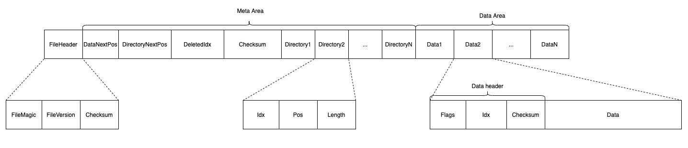
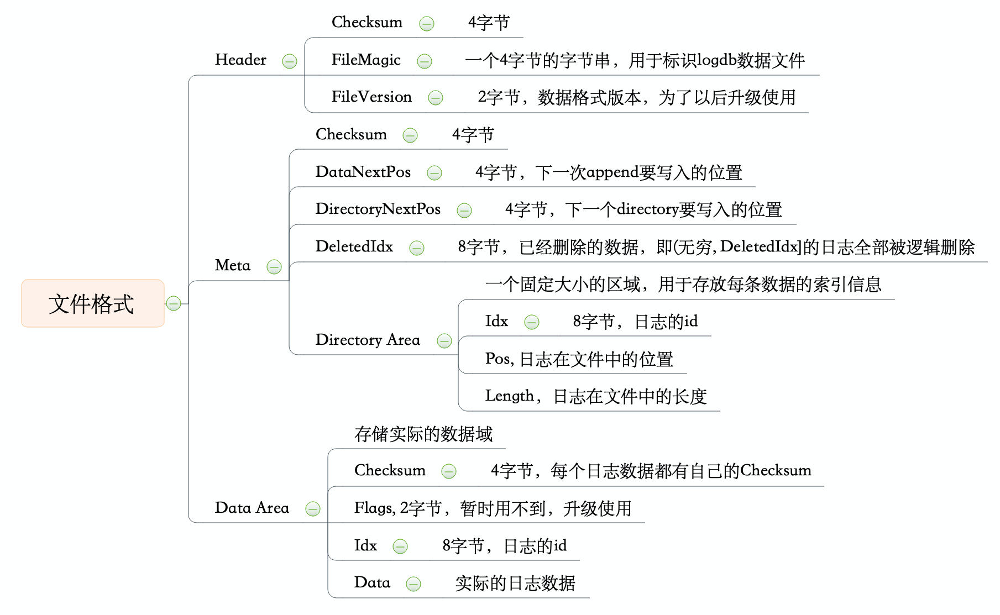

## 前言
logdb用于管理Paxos协议的日志数据，其主要要实现下面几个接口：
+ 用于追加日志并在磁盘上做sync的AppendAndSync接口
+ 在AppendAndSync的接口上，增加一个从磁盘上从左往右删除日志的AppendAndSync3接口
+ 根据日志ID获取对应日志的GetValueByIdx接口
+ 获取当前logdb可用的index范围的GetCurrentIdxRange接口

## 目标
整体说来logdb需要提供append, delete，get语义。其实logdb是一个十分轻量级的日志存储组件，我们并没有直接采用现有的存储引擎来存储paxos的日志信息的原因是，logdb需要提供的语义是十分简单的，且并没有复杂的事务需求。并且现存的无论是基于B树的或者LSM树的存储引擎，都存在十分巨大的写放大开销，无法完全榨干磁盘的IO。以上，我们希望logdb:
+ 足够轻量级，并且做到可插拔
+ 能最大限度地向上层提供读写的速度保障
+ 保证写入的数据在机器宕机或者掉电时，数据依然安全可用。


## 设计
接下来讲述logdb的具体设计方案，主要包括以下内容：
+ logdb文件格式
+ append，get, delete实现过程


### 文件格式

下面两张图是logdb的文件格式。注意为了便于检索，我们将每条数据的位置信息用一个三元组记录。每一个三元组，我们称之为一个directory，存放在directory area内。

```
// idx： uint64类型，表示数据的id
// pos: uint32类型，表示数据在文件中的偏移
// length: uint32类型，表示数据的长度
(idx, pos, length)
```






### append
append操作流程如下：
1. 将该条数据从文件的DataNextPos偏移开始写入
2. 计算该条文件的directory，即位置三元组，将该信息从DirectoryNextPos开始写入
3. 写入完成后做fsync，保证数据已经写入磁盘
4. 更新DataNextPos和DirectoryNextPos到文件
5. 继续对文件做fsync。因为Meta域的Checksum、DataNextPos、DirectoryNextPos、DeletedIdx一共20Byte，因此一定能保证原子地同时写入磁盘。


### delete
delte操作不会真的删除数据，而仅仅是做个标记表示逻辑删除。删除时，更新DeletedIdx并写入文件即可。


### get
get操作流程如下：
1. 先比较要get的数据idx，是否小于等于DeletedIdx，如果是的话，直接返回
2. 如果Directory Area不在内存中，则将其读入内存
3. 在Directory Area中二分查找要get的数据，找到后返回


